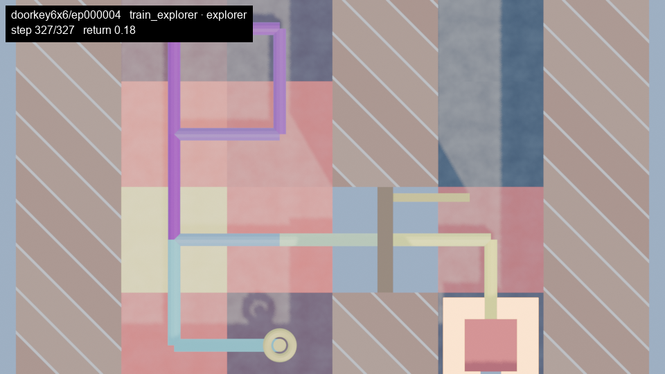

# wm-viz

Browse, preview and render the episodes recorded by the [wm](https://github.com/neural-data-science-lab/wm)
exploration benchmark.

`wm` writes a compact ground-truth trace of every episode it plays: the
maze layout, the agent's position and heading at each step, what it
carried, which doors it opened, actions and rewards. `wmviz` reads those
traces so you can answer questions like *"show me the first episode where
the Plan2Explore agent reached the goal"* or *"which coverage-eval episode
at step 50k visited the most cells"* — and look at it, right in the
terminal, as a PNG, or as a rendered Blender animation.



*`wmviz render doorkey6x6/ep000004 --preview --trail --heatmap --hud --still 327`
— rendered against `tests/fixtures`, 960×540, no camera tricks.*

Rendering is implemented: `wmviz render` produces Blender animations and
stills, `figure`/`timeline`/`heatmap` build static and animated figures on
top of it, and everything also runs through a matplotlib fallback that
needs no Blender.

## Installation

Requires [uv](https://docs.astral.sh/uv/) and Python 3.11 (pinned, because
the Blender `bpy` wheel only exists for 3.11 — this repo was verified
against `bpy` 5.0.1).

```bash
git clone https://github.com/maxboettinger/wm-viz
cd wm-viz
uv sync --extra blender --group dev     # everything: CLI, reader, previews, renderer, tests
```

Smaller installs:

```bash
uv sync --group dev          # CLI, reader, ASCII + PNG previews, tests — no Blender
uv sync --extra figures      # matplotlib PNG previews only, no dev group
uv sync --extra blender      # bpy — needed for `render`/`figure`/`timeline`/`heatmap`'s Blender backend
```

Run the CLI with `uv run wmviz …`, or activate the venv and call `wmviz`
directly.

Without `bpy`, `figure`, `timeline` and `heatmap` still work through
`--backend mpl` (or fall back to it automatically); `render` needs `bpy`.
For manual tweaking, `wmviz render … --save-blend out.blend --no-render`
stops after writing the scene — no render, no mp4 — so you can open
`out.blend` in Blender ≥ 5.0 and look around, move lights, or hand-render
a frame yourself.

## Quick start

Point `wmviz` at a `wm` logs directory, either with `--logs` or the
`WMVIZ_LOGS` environment variable. Three small real runs are checked in as
test fixtures (one of them dream episodes), so you can try everything
without training anything:

```bash
export WMVIZ_LOGS=tests/fixtures      # later: /path/to/wm/logs

wmviz runs                            # which runs have traces?
wmviz list doorkey6x6 --phase eval    # episodes of one run, as a table
wmviz pick doorkey6x6 --first-success # resolve one episode to a reference
wmviz show doorkey6x6/ep000004        # stats + ASCII map
wmviz show doorkey6x6/ep000004 --png ep4.png
```

`runs` and `list` print tables:

```
$ wmviz runs
┏━━━━━━━━━━━━━━━━━━┳━━━━━━━━━━━━━━━━━━━━━━━━━━━━━┳━━━━━━━━━━━━━━┳━━━━━━━━━━┳━━━━━━━━━━━┓
┃ run              ┃ env                         ┃ exploration  ┃ episodes ┃ last step ┃
┡━━━━━━━━━━━━━━━━━━╇━━━━━━━━━━━━━━━━━━━━━━━━━━━━━╇━━━━━━━━━━━━━━╇━━━━━━━━━━╇━━━━━━━━━━━┩
│ doorkey6x6       │ MiniGrid-DoorKey-6x6-v0     │ plan2explore │ 10       │ 800       │
│ dream-doorkey6x6 │ MiniGrid-DoorKey-6x6-v0     │ plan2explore │ 4        │ 400       │
│ multiroom-n4s5   │ MiniGrid-MultiRoom-N4-S5-v0 │ plan2explore │ 12       │ 800       │
└──────────────────┴─────────────────────────────┴──────────────┴──────────┴───────────┘

$ wmviz list multiroom-n4s5 --limit 3
┏━━━━━━━━━━━━━━━━━━━━━━━━━┳━━━━━━━━━━━━━━━┳━━━━━━━━━━┳━━━━━━┳━━━━━━━┳━━━━━┳━━━━━━━━┳━━━━┳━━━━━━━┳━━━━━━┳━━━━━━┳━━━━━━━┳━━━━━━━┳━━━━━━━┳━━━━━━━━┓
┃ ref                     ┃ phase         ┃ actor    ┃ seed ┃ start ┃ len ┃ return ┃ ok ┃ cells ┃ cov% ┃ key@ ┃ door@ ┃ goal@ ┃ rooms ┃ layout ┃
┡━━━━━━━━━━━━━━━━━━━━━━━━━╇━━━━━━━━━━━━━━━╇━━━━━━━━━━╇━━━━━━╇━━━━━━━╇━━━━━╇━━━━━━━━╇━━━━╇━━━━━━━╇━━━━━━╇━━━━━━╇━━━━━━━╇━━━━━━━╇━━━━━━━╇━━━━━━━━┩
│ multiroom-n4s5/ep000013 │ coverage_eval │ explorer │ 2001 │ 800   │ 120 │ 0      │    │ 4     │ 11   │      │       │       │ 1     │ f71486 │
│ multiroom-n4s5/ep000012 │ coverage_eval │ explorer │ 2000 │ 800   │ 120 │ 0      │    │ 7     │ 21   │      │ 1     │       │ 1     │ 3daa99 │
│ multiroom-n4s5/ep000011 │ eval          │ task     │ 1001 │ 800   │ 120 │ 0      │    │ 1     │ 3    │      │       │       │ 1     │ 30b4c6 │
└─────────────────────────┴───────────────┴──────────┴──────┴───────┴─────┴────────┴────┴───────┴──────┴──────┴───────┴───────┴───────┴────────┘
… 9 more (use --limit)
```

`pick` prints a single reference, which makes it composable in a shell:

```bash
wmviz show $(wmviz pick p2e-n6-s0 --best-return --phase eval)
wmviz show $(wmviz pick p2e-n6-s0 --most-cells --phase coverage_eval --at-step 50000) --png best.png
```

Rendering, once `bpy` is installed (`uv sync --extra blender`):

```bash
wmviz render doorkey6x6/ep000004 --preview --trail --hud            # mp4, ~0.35 s/frame
wmviz render doorkey6x6 --first-success --camera follow,topdown --still 120 --out key.png
wmviz figure doorkey6x6/ep000004 --keyframes auto --out strip.png     # key / door / goal / end
wmviz timeline multiroom-n4s5 --seed 2000 --milestones 0,400,800 --out timeline.png
wmviz heatmap multiroom-n4s5 --layout seed:2000 --out heat.png
```

All five were run once against `tests/fixtures` before going into this
README (`--backend mpl` on `figure`/`timeline`/`heatmap` skips Blender
entirely if you don't have `bpy`). The `render` line above writes an mp4;
`--still N` (used on the second line) writes a PNG for step `N` instead.

## Command reference

| Command | What it does |
|---|---|
| `wmviz runs` | Lists every run under `--logs` that contains traces, with env, exploration method, episode count and last recorded step |
| `wmviz list RUN` | Prints the episodes of a run as a table. Accepts the filters below plus `--sort`, `--asc`, `--limit` |
| `wmviz pick RUN` | Applies the filters, then one selector, and prints exactly one `<run>/ep000123` reference. Fails with a hint if nothing matches |
| `wmviz show REF` | Prints an episode's stats and an ASCII top-down map; `--png PATH` also writes a matplotlib preview |
| `wmviz render TARGET` | Renders one episode as a Blender mp4, or a `--still N` PNG. `--camera` defaults to `topdown` (`fpv` for dream episodes); `--trail`, `--heatmap`, `--hud` add overlays |
| `wmviz figure TARGET` | One still of an episode (top-down, trail + heatmap on by default); `--keyframes auto\|3,57,120` composes a labelled strip instead of a single image |
| `wmviz timeline RUN` | The seed-`S` episode nearest each `--milestones` step, as a labelled strip; `--video` tiles the animations in sync instead |
| `wmviz heatmap RUN` | Visit counts accumulated over the selected episodes of one layout; `--animate` fills the floor in episode by episode (mp4), `--compare RUN2` puts a second run side by side |

`render` and `figure` take a `TARGET`: either `<run>/ep000123` directly, or
a run name plus the filters and one selector below. `timeline` and
`heatmap` instead take a `RUN` and pick episodes themselves — by
milestone/seed or by layout, see their rows above — so the filters and
selectors below don't apply to them (`heatmap` takes its own `--phase`/
`--actor`). Episode references look like `<run>/ep000123`; `<run>/123` is
accepted too.

**Filters** (shared by `list`, `pick`, `render`, `figure`):

| Option | Keeps episodes that… |
|---|---|
| `--phase P` | belong to phase `P`: `train_task`, `train_explorer`, `train_random`, `eval`, `coverage_eval`, `dream` |
| `--actor A` | were played by actor `A`: `task`, `explorer`, `random` |
| `--after-step N` / `--before-step N` | started at or after / ended at or before global env step `N` |
| `--success` / `--no-success` | reached the goal / did not |
| `--min-cells N` | visited at least `N` distinct cells |
| `--layout HASH` | were played on the layout whose hash starts with `HASH` |
| `--layout seed:N` | were reset with seed `N` (eval and coverage-eval episodes carry a seed) |

**Sorting** (`list`): `--sort return|unique_cells|length|start_step|episode_id|coverage_pct`
(default `episode_id`, descending; `--asc` flips it; `--limit` caps rows,
default 50).

**Selectors** (`pick`, and `render`/`figure` in place of a `<run>/ep000123`
target — exactly one):

| Selector | Picks the episode with… |
|---|---|
| `--best-return` | the highest return |
| `--most-cells` | the most distinct cells visited |
| `--first-success` | the earliest goal reach |
| `--first-key` / `--first-door` | the earliest key pickup / door opening |
| `--at-step N` | the closest start step to `N` |
| `--latest` | the highest start step |

### `render` options

*What to draw:*

| Option | Meaning |
|---|---|
| `--camera C[,C2,…]` | `topdown`, `follow`, `fpv`, `orbit`, `iso`; a comma list renders each and composites them side by side. Default `topdown`, or `fpv` for dream episodes |
| `--trail` | one thin cylinder per moved step, coloured by time (viridis-like) |
| `--heatmap` | floor tiles glow by cumulative visit count (black → red → yellow), growing during the animation |
| `--hud` | run/episode id, phase, actor, step and return stamped in the corner |
| `--dream-layout pip\|split` | dream episodes only — picture-in-picture inset or a side-by-side split; see [Dream vs. reality](#dream-vs-reality) |

*Quality / cost:*

| Option | Meaning |
|---|---|
| `--engine eevee\|cycles` | default `eevee` |
| `--samples N` | render samples, default 64 (Cycles only matters much) |
| `--res WxH` | default `1920x1080`, must be even in both dimensions (libx264) |
| `--fps N` | output frame rate, default 24 |
| `--frames-per-step N` | Blender frames per env step, default 6 |
| `--discrete` | no interpolation between steps (snaps instead of tweening) |
| `--preview` | shortcut for `--res 960x540` and 3 frames per step |

*Outputs:*

| Option | Meaning |
|---|---|
| `--out PATH` | mp4, or PNG with `--still`; default `renders/<run>/<ep>.mp4` |
| `--still N` | render one frame at step `N` instead of the whole animation |
| `--save-blend PATH` | write the built scene as a `.blend` |
| `--no-render` | stop after `--save-blend` (needs it) — the GUI path |
| `--assets PATH` | asset library `.blend`; see [Asset library](#asset-library) |

### Render cost

Measured on Apple Silicon (Metal):

| Setting | Cost |
|---|---|
| Eevee, 960×540 (`--preview`) | ≈ 0.35 s/frame steady state |
| Eevee, 1920×1080 (default) | ≈ 1 s/frame |
| Cycles, 1920×1080, 64 samples | ≈ 22 s per still |
| `--preview` mp4, full 327-step episode (982 frames @ 3 frames/step) | ≈ 5.7 min |

**Resume:** frames render to `<out stem>_frames/<camera>/f00001.png…`
first, and a completed frame is skipped on the next run — an interrupted
render (or a re-run with the same settings) only renders what's missing.
`<out stem>_frames/render.json` fingerprints the settings that change a
pixel (resolution, engine, samples, frames-per-step, discrete, cameras,
trail, heatmap, assets); if it doesn't match the current invocation, the
whole folder is wiped and re-rendered from scratch. Delete the folder
yourself to force a full re-render. Each frame renders to a `.tmp.png`
first and is atomically renamed, so a killed render never leaves a
half-written PNG behind.

## Asset library

`--assets lib.blend` swaps the procedural primitives for objects from your
own `.blend` file, looked up by name: `Agent`, `Key`, `DoorPanel`,
`DoorFrame`, `Wall`, `Floor`, `Goal`. Any name not found in the library
falls back to the procedural version, so a partial library (e.g. just a
nicer `Agent`) works fine. Library objects are relinked into the scene's
per-type collections (`Floor`, `Walls`, `Doors`, `Items`, `Agent`) like
everything else.

One gotcha: a library `DoorPanel` must have its mesh origin at the hinge
edge and extend along local **+X** — the scene builder sets its `location`
to the hinge cell and its `rotation_euler.z` to the wall's yaw, the same
way the procedural panel is placed, so an origin anywhere else makes the
door swing from the wrong point.

## Dream vs. reality

Episodes with `phase=dream` are recorded by `train_dreamer.py` at every
`--video-every` checkpoint (`--dream-actor task|explorer|both` controls
which policy dreams). For these, `render` defaults to `--camera fpv` — eye
height, agent yaw — because that's the view the world model's decoded
frames are meant to compare against.

The world model tracks the real episode for the first `dream_start` steps
(posterior reconstructions), then dreams open-loop for the rest
(imagined states). `render` composites the small decoded frames onto the
Blender view:

- `--dream-layout pip` (default) — "real obs" and "dream"/"recon" insets
  in a corner.
- `--dream-layout split` — Blender view and decoded frame side by side at
  equal size.

Either way, a **white** border/divider means the model is still tracking
(posterior reconstruction); it turns **black** once the model starts
dreaming (open-loop imagination) at `dream_start`. `--still N` renders one
labelled panel, handy for a paper figure.

```bash
wmviz render dream-doorkey6x6/ep000002 --preview --still 10 --hud --out dream.png
```

## Reading the map

`show` draws the layout top-down. Each cell shows how many times the
agent stood on it: digits for 1–9, `*` for ten or more. `S` and `E` mark
where the episode started and ended, `D`/`K`/`G` are doors, keys and the
goal, `#` walls, `.` is unvisited floor. The PNG preview (`--png`) draws
the same layout with the trajectory as a line coloured by time (dark
start, yellow end), a white circle at the start and a black square at the
end.

The header line above the map is the index row for that episode: phase,
actor, reset seed, global step range, length, return, success, cells and
coverage, the step of the first key / door / goal event, rooms entered
(MultiRoom only) and the layout hash.

## Using the reader from Python

The CLI is a thin layer over `wmviz.trace`, which you can use directly in
notebooks or scripts:

```python
from wmviz.trace.reader import Index, Episode
from wmviz.trace.selectors import Filters, apply_filters, sort_rows, pick

idx = Index.load("tests/fixtures/doorkey6x6")
rows = sort_rows(apply_filters(idx.rows, Filters(phase="eval")), "return")
best = pick(idx.rows, "first-success")

ep = Episode.load(idx.path_of(best))
ep.agent_pos          # (T+1, 2) int64 — x, y per step
ep.agent_dir          # (T+1,) 0=east 1=south 2=west 3=north
ep.door_open          # (T+1, n_doors) bool
ep.layout.rooms       # list of (x, y, w, h) for MultiRoom envs
ep.layout.doors       # {(x, y): colour}
ep.meta["env_id"], ep.length, ep.ret
```

`Layout.from_grid` decodes MiniGrid's `grid.encode()` array into walls,
doors, keys, goals and lava without importing `minigrid`, so `wmviz` has
no dependency on the training stack.

## Trace format

`wm` writes `logs/<run>/trace/index.csv` (one row per episode, appended
as episodes finish) and one `logs/<run>/trace/episodes/ep_NNNNNN.npz`
per episode. Each npz contains a JSON `meta` string and these arrays:

| Array | Shape | Content |
|---|---|---|
| `layout` | `(W, H, 3)` uint8 | MiniGrid `grid.encode()` at reset: object, colour, state per cell |
| `rooms` | `(n_rooms, 4)` | MultiRoom only: `x, y, w, h` per room |
| `actions` | `(T,)` | Action taken at each step |
| `rewards` | `(T,)` float32 | Reward received at each step |
| `terminated`, `truncated` | scalar bool | How the episode ended |
| `agent_pos` | `(T+1, 2)` | Agent x, y before each step and after the last |
| `agent_dir` | `(T+1,)` | Agent heading |
| `carrying` | `(T+1,)` | Object index carried, `-1` for nothing |
| `door_pos` | `(n_doors, 2)` | Door cells, fixed for the episode |
| `door_open` | `(T+1, n_doors)` | Whether each door was open |
| `obs` | `(T+1, H, W, 3)` uint8 | Observations, only when `wm` ran with `--trace-pixels` enabling that phase |
| `dream_start` | scalar int | Dream episodes only: index of the first imagined state |
| `recon_frames` | `(dream_start, H, W, 3)` uint8 | Dream episodes only: the world model's posterior reconstructions of states `0..dream_start-1` |
| `dream_frames` | `(horizon, H, W, 3)` uint8 | Dream episodes only: imagined states from `dream_start` on |

The format is versioned (`format_version` 1 in `meta`); the reader
rejects other versions rather than guessing. The writer lives in
`wm/trace.py` in the `wm` repo; the two projects share no code, only
this file contract.

## Repository layout

```
wmviz/trace/reader.py     Index, IndexRow, Episode, Layout, parse_ref, find_runs
wmviz/trace/selectors.py  Filters, apply_filters, sort_rows, pick
wmviz/preview.py          ascii_map, save_png
wmviz/compose.py          strips, grids, labels, HUD, picture-in-picture, split view (no bpy)
wmviz/aggregate.py        visit-count aggregation, same-layout grouping (no bpy)
wmviz/mpl.py              matplotlib backend for figure/timeline/heatmap (no bpy)
wmviz/scene/base.py       Style, materials, asset-library lookup, F-curve helpers (bpy)
wmviz/scene/minigrid.py   build_scene: layout → Blender objects (bpy)
wmviz/animate.py          keyframes agent, doors, carried key (bpy)
wmviz/cameras.py          topdown/follow/fpv/orbit/iso presets (bpy)
wmviz/overlays.py         trail, heatmap overlays (bpy)
wmviz/render.py           RenderConfig, frame rendering, resume, mp4 (bpy at call time)
wmviz/cli.py              the wmviz command (runs, list, pick, show, render, figure, timeline, heatmap)
scripts/trim_trace.py     trims a full wm trace down to a small fixture
tests/                    unit tests + contract tests against real wm traces
tests/fixtures/           three real, trimmed runs, one of them dream episodes (see tests/fixtures/README.md)
```

Modules under `wmviz/scene/` plus `animate.py`, `cameras.py`, `overlays.py`
and `render.py` import `bpy`; everything else (`trace/`, `preview.py`,
`compose.py`, `aggregate.py`, `mpl.py`) does not, so listing, filtering and
matplotlib previews work without Blender installed. `bpy` is imported
lazily inside functions, never at module import time.

## Development

```bash
uv sync --extra blender --group dev
uv run pytest -q
```

`tests/conftest.py` builds synthetic traces that mirror `wm`'s writer;
`tests/test_fixtures_real.py` checks the reader against real recordings
so a format drift in `wm` shows up here. To refresh the fixtures after a
`wm` format change, follow `tests/fixtures/README.md`.

Tests that need `bpy` (scene building, rendering) are marked `slow` and
skip automatically when `bpy` isn't importable. Without Blender:

```bash
uv sync --group dev
uv run pytest -q -m "not slow"     # 80 of 124 tests, no bpy needed
```

Note that `MiniGrid-MultiRoom-N4-S5-v0` generates six rooms, not four —
an upstream naming quirk in `minigrid`, documented in the fixtures README.

## Roadmap

- Ghost agent from a position probe: render a translucent agent at the
  world model's believed position during dreaming, from
  `analysis/probe_latents.py` (spec §5 future extension).
- MiniWorld family: a second `scene/` builder and `TraceExtractor` for
  continuous 3D envs, behind the same `env_family` dispatch the trace
  format already reserves.
